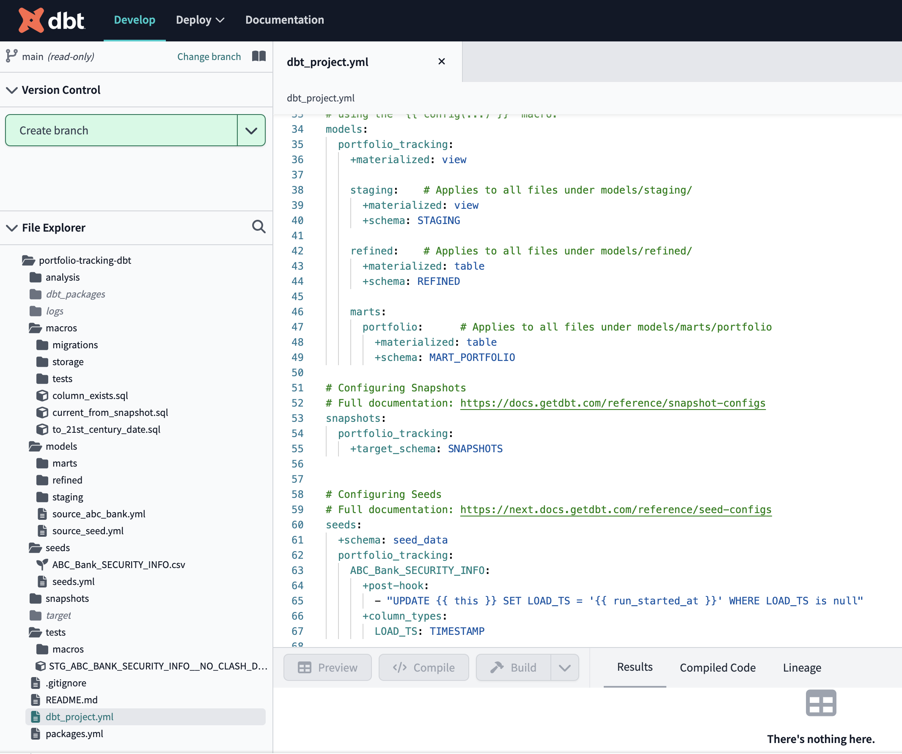

# Data Engineering with dbt - Code Samples
This repository contains code samples for the book **Data Engineering with dbt** by Roberto Zagni, published by PacktPublishing.

Please look up the [LICENSE](LICENSE) before using this repository.

## Organization of this Repository
This is not the repository for the dbt project used as a sample in the book, even if it includes the code for that project.
At the end of this readme there is a small presentation of [the sample dbt project](#the-sample-dbt-project) 

The files in this repo represents the **evolution of the code** as discussed in the different chapters of the book.
Because of that the files are organized by book chapter.

When one source file undergoes many substantial changes in a chapter we have provided multiple versions of the file to
represent the multiple stages discussed in the chapter.

### Samples from the introductory chapters
In the first chapters we introduce Snowflake and dbt and the samples are about snippets of code, 
so we have provided one file per section as often individual snippets are too tiny to justify a single file per sample.
Longer samples can be in their own file.

### Code from the remaining chapters
In chapter 5 we start the sample dbt project and from that point onward each file in this repo represents
one version of a file in the dbt project or a sample that we have discussed even if not part of the sample project.

Inside each chapter the files that represent dbt objects (models, macros and others) are under a `dbt` folder, 
while other files that might represent CSV files or commands to be executed in Snowflake are in separate folders. 

In the early phases of the sample project we have few models, so they all are under the `dbt` folder.
When we have multiple types of dbt object we have placed each type of file in its sub-folder. 

## The sample dbt project
The book **Data Engineering with dbt** uses a sample project to describe how dbt works with a practical approach.

The sample starts simple and then is evolved introducing more dbt features and software engineering best practices.

The sample is not intended to be a full fledged project, but just a tool to discuss ho to approach the building 
of real dbt projects applying the right features and best practices.

As such the sample project uses few dbt models and evolves them by introducing new dbt features 
and explaining the software engineering principles that guide the evolution of the models or the use of one 
feature instead of another.

In the book we often refer to the organization of the sample project, including folder names.
The layout of the sample dbt project described in the book can be seen in the following picture: 

